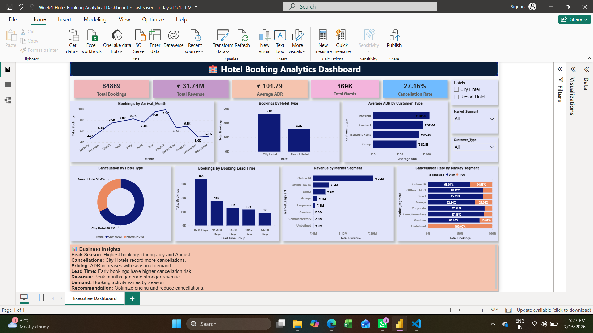

# Hotel Booking Customer Retention & Dynamic Pricing Analysis

## Project Overview

This project focuses on analyzing hotel booking data to understand customer behavior, cancellation patterns, pricing trends, and revenue contribution.

The objective of this project is to build an end-to-end analytics solution by performing data cleaning, exploratory analysis, predictive modeling, and developing an interactive Power BI dashboard to support business decision-making.

---

# Business Objectives

- Analyze hotel booking trends and customer behavior.
- Identify factors influencing booking cancellations.
- Understand revenue contribution across different market segments.
- Predict potential booking cancellations using machine learning.
- Build an interactive dashboard for business insights.

---

# Project Workflow

The project was completed in multiple phases:

1. Data Cleaning & Feature Engineering
2. Exploratory Data Analysis & Statistical Testing
3. Predictive Modeling
4. Power BI Dashboard Development
5. Business Insights & Recommendations

---

# Week 1: Data Cleaning & Feature Engineering

## Data Preparation

Performed data cleaning and transformation using Python.

### Activities Performed

- Removed missing values.
- Removed duplicate records.
- Handled inconsistent data values.
- Identified and treated ADR outliers using IQR method.

## Feature Engineering

Created new business-focused features:

### Total Stay Nights

Combined:
- Weekend nights
- Week nights

### Total Guests

Combined:
- Adults
- Children
- Babies

### Total Revenue

Calculated revenue contribution using:

ADR × Total Stay Nights

These engineered features helped improve customer behaviour analysis and predictive modeling.

---

# Week 2: Exploratory Data Analysis (EDA)

Performed detailed exploratory analysis to understand booking patterns.

## Analysis Performed

- Hotel type comparison.
- Monthly booking trends.
- Customer type analysis.
- Market segment analysis.
- ADR distribution analysis.
- Lead time analysis.
- Cancellation pattern analysis.

## Statistical Analysis

Performed correlation analysis to understand relationships between:

- Cancellation status
- Lead time
- ADR
- Revenue-related variables

---

# Week 3: Predictive Modeling

## Objective

The objective of predictive modeling was to predict whether a booking would be cancelled based on customer and booking characteristics.

## Problem Type

Binary Classification

Target Variable:

```
is_canceled
```

## Model Used

### Logistic Regression

Logistic Regression was selected because:

- Suitable for binary classification problems.
- Easy to interpret.
- Provides probability-based predictions.
- Works efficiently as a baseline classification model.

---

## Model Preparation

Before training the model:

- Applied feature encoding for categorical variables.
- Prepared independent and dependent variables.
- Split data into training and testing datasets.

---

## Model Evaluation

The model performance was evaluated using:

- Accuracy
- Precision
- Recall
- F1 Score
- Confusion Matrix
- ROC Curve
- AUC Score

These evaluation metrics helped measure how effectively the model identifies cancellation risks.

---

# Week 4: Power BI Dashboard Development

## Dashboard Objective

Developed an interactive executive dashboard to provide business insights related to hotel bookings, revenue, customer segments, and cancellation behaviour.

---

# Dashboard KPIs

The dashboard includes:

## Total Bookings

Shows the overall number of hotel bookings analysed.

## Total Revenue

Represents revenue contribution based on booking information.

## Average Daily Rate (ADR)

Shows average room pricing per night.

## Total Guests

Represents total customer occupancy.

## Cancellation Rate

Shows percentage of cancelled bookings.

---

# Dashboard Visualizations

The dashboard includes:

- Monthly Booking Trend
- Booking Distribution by Hotel Type
- Average ADR by Customer Type
- Revenue Contribution by Market Segment
- Booking Distribution by Lead Time Group
- Cancellation Distribution by Hotel Type
- Cancellation Rate by Market Segment

Interactive slicers were added for:

- Hotel Type
- Customer Type
- Market Segment




---

# Business Insights

Key insights derived from the dashboard:

- City Hotels receive higher booking volumes compared to Resort Hotels.
- Online Travel Agents contribute significantly to revenue generation.
- Lead time influences customer booking behaviour.
- Customer types show differences in ADR values.
- Cancellation rates vary across different market segments.

---

# Business Recommendations

Based on analysis:

- Improve customer retention through loyalty programs.
- Optimize pricing strategies using ADR trends.
- Reduce cancellations through improved booking policies.
- Focus marketing efforts on high-value segments.
- Use booking trends for better demand forecasting.

---

# Tools & Technologies Used

## Programming & Analysis

- Python
- Pandas
- NumPy
- Matplotlib

## Database

- MySQL
- SQL

## Visualization

- Microsoft Power BI
- Microsoft Excel

## Version Control

- Git
- GitHub

---
---

## Repository Structure

```text
Hotel-Booking-Customer-Retention-Analysis/

├── Data/
│   ├── hotel_bookings.csv
│   └── hotel_bookings_cleaned.csv

├── notebooks/
│   ├── 1-Data_Cleaning.ipynb
│   └── 2_EDA_and_Statistical_Testing.ipynb
    └── 3_Baseline_Predictive_Modeling.ipynb


├── PowerBI/
│   └── Hotel_Booking_Dashboard.pbix

├── Presentation/
│   ├── Week1 & Week2-project2pptx.pptx
    ├── Week3 & Week4-project2.pptx   

├── Documentation/

│   ├── Week1_Week2_Business_Insights.md
│   ├── Week3_Report.docx
│   ├── Week3_Report.pdf
│   ├── Week4_Report.docx
│   └── Week4_Report.pdf

├── Hotel_Booking_Dashboard.png

└── README.md


---

# Project Outcome

This project demonstrates an end-to-end analytics workflow:

- Data Cleaning
- Feature Engineering
- Exploratory Data Analysis
- Statistical Analysis
- Predictive Modeling
- Machine Learning Evaluation
- Power BI Dashboard Development
- Business Recommendation Generation

The project demonstrates how analytics can support customer retention strategies and revenue optimization in the hospitality industry.

---

# Current Status

✅ Data Cleaning Completed  
✅ Feature Engineering Completed  
✅ Exploratory Data Analysis Completed  
✅ Statistical Analysis Completed  
✅ Predictive Modeling Completed  
✅ Power BI Dashboard Completed  
✅ Business Insights Added  
✅ Final Presentation Completed  

---

# Future Enhancements

- Customer segmentation analysis.
- Booking demand forecasting.
- Revenue prediction model.
- Automated KPI reporting.

---

# Author

**Ishwarya**

B.Sc. Information Technology

Master's in Data Analytics

Data Analytics Intern – Infotact